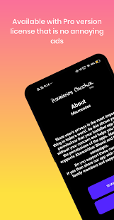
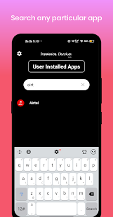
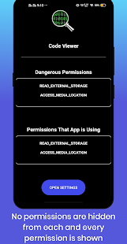
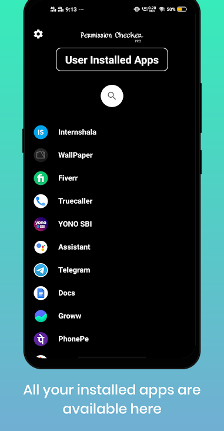

# PermissionManagementApp

This app shows you all the permission that your installed app is asking for or your installed app is using without your permission.
This app shows each and every permission that the app is using in the human readable form.
# Google PlayStore Link
<a href="https://play.google.com/store/apps/details?id=in.macrocodes.databasedemo">Redirect to Google Play Store</a>

# App Screenshots

    

# Advantages

 - This app has no ads and do not contains any in app purchases and is totally free. So if you want you can give it a try.
 - Search the name of the app in the <b>search box</b>.
 - Click on the app to view each and every permission which the app is using in your android device.

# License
Licensed under the [Apache Licence 2.0](LICENSE).
